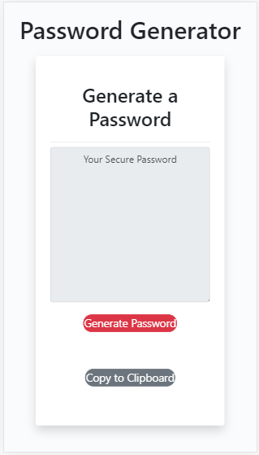
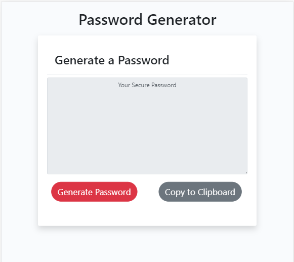
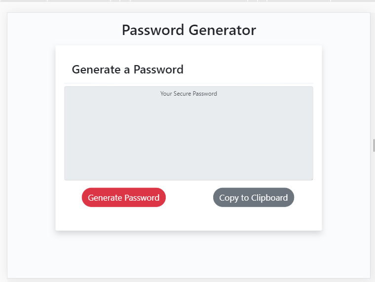

# PasswordGenerator
Description

This is an application that generates a random password based on user-selected criteria. This app will run in the browser and it was responsively styled to be displayed in larger to super small screens.

Key words : Password Generator, For Loops, If stataments, Functions, Objects Methods.

### Technologies-Libraries
- [Bootstrap](https://getbootstrap.com/) - CSS Framework

### Link

https://cibellem.github.io/PasswordGenerator/

Below some screen shots on how the password generator will look like in different screens.

Below are some screenshots on how the website it's going to look:  
  
  
  

